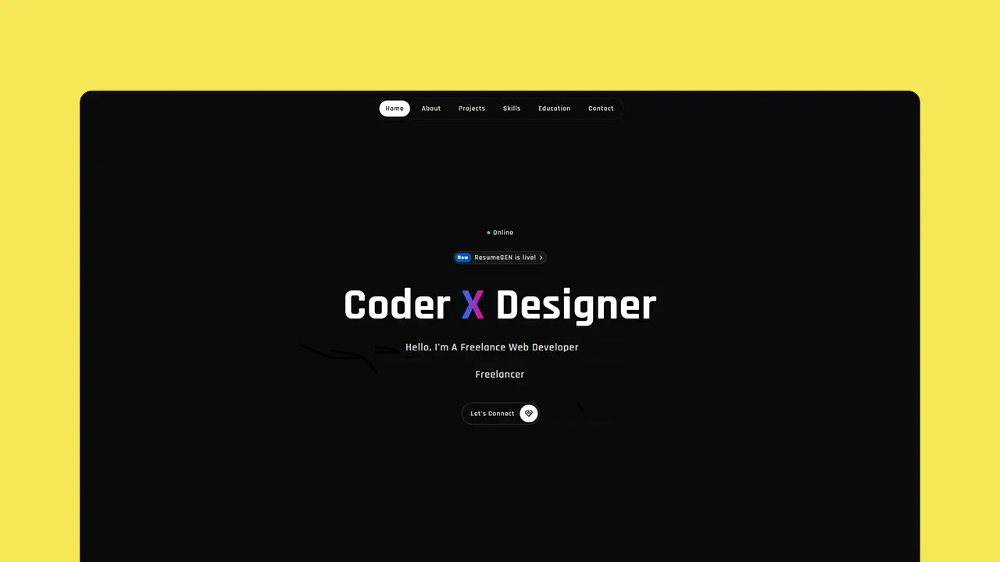

<p align="center"></p>

Welcome to the repository for my personal portfolio website! This site showcases my skills, projects, and journey as a passionate Full Stack Developer. It's designed to be a clean, engaging, and informative platform for anyone interested in learning more about my work and capabilities.


## ✨ Features

*   **📄 Single-Page Design:** Smooth navigation through different sections (Home, About, Projects, Skills, Contact) without page reloads.
*   **🎨 Modern & Responsive UI:** A visually appealing design that adapts seamlessly to various screen sizes (desktop, tablet, mobile).
*   **✒️ Typed.js Introduction:** Engaging auto-typing effect in the hero section to highlight key skills or roles.
*   **🎉 Interactive Elements:** Subtle animations and effects (like Confetti.js, though its usage isn't explicitly detailed in the HTML, it's linked) to enhance user experience.
*   **💡 Project Showcase:** Dedicated section to display key projects with descriptions, technologies used (tags), and links to live demos & source code.
*   **🛠️ Skills Overview:** Clear presentation of technical skills with associated icons.
*   **📬 Contact Section:** Easy ways to get in touch via social media links and a welcoming message.
*   **🌗 Dark/Light Theme (Implied):** While not explicitly stated, modern portfolios often include this. If yours does, highlight it! (If not, it's a great future addition).
*   **🚀 Optimized for Performance:** Lazy loading for images (`loading="lazy"`) and clean HTML/CSS.


## 🛠️ Tech Stack

This portfolio is built with fundamental web technologies, focusing on a lightweight and efficient approach:

*   **HTML5:** For the semantic structure of the content.
*   **CSS3:** For all styling, layout, and responsiveness.
*   **Vanilla JavaScript:** For interactivity, navigation highlighting, menu toggles, and integrating libraries.
*   **External Libraries:**
    *   `Typed.js`: For the auto-typing effect.
    *   `Confetti.js`: For celebratory confetti effects (if implemented on specific actions).
    *   (Potentially other small utility scripts included in `script.js` or `portfo script.js`)


## 🚀 Getting Started Locally

1.  **Clone the repository (or download the files):**
    ```bash
    git clone https://your-repository-url/your-portfolio.git
    cd your-portfolio
    ```
2.  **Open `index.html` in your browser:**
    Since this project primarily uses HTML, CSS, and basic JavaScript (with libraries that should load correctly from CDNs or local paths if you've set them up), you can often just open the `index.html` file directly in your web browser.
    *   `file:///path/to/your/project/index.html`

    If you encounter any issues with scripts not loading (especially if you were to use ES Modules in the future), you might need a simple local HTTP server as described in the previous README. However, for this current structure, direct file opening should generally work.

## 🌐 Deployment

This portfolio is a static website and can be easily deployed for free on various platforms:

*   **Netlify:** (Recommended for ease of use)
*   **Vercel**
*   **GitHub Pages**
*   **Cloudflare Pages**

Simply upload your project files ( `index.html`, `portfo style.css`, `portfo script.js`, and your `assets` folder) to the root of the deployment.

**Configuration for these platforms:**
*   **Build command:** None (or leave blank).
*   **Publish/Output directory:** The root of your project.


## 💡 Future Enhancements (Ideas)

*   **Blog Section:** Add a simple blog to share insights or tutorials.
*   **More Animations/Transitions:** Enhance UI with subtle hover effects or page scroll animations.
*   **Contact Form Integration:** Use a service like Formspree or Netlify Forms for a functional contact form.
*   **Accessibility (A11y) Audit:** Ensure high accessibility standards.
*   **Performance Optimization:** Further optimize images, minify CSS/JS.
*   **Content Management System (CMS):** For easier updates to projects or blog posts (e.g., headless CMS).


Thank you for visiting my portfolio repository!
